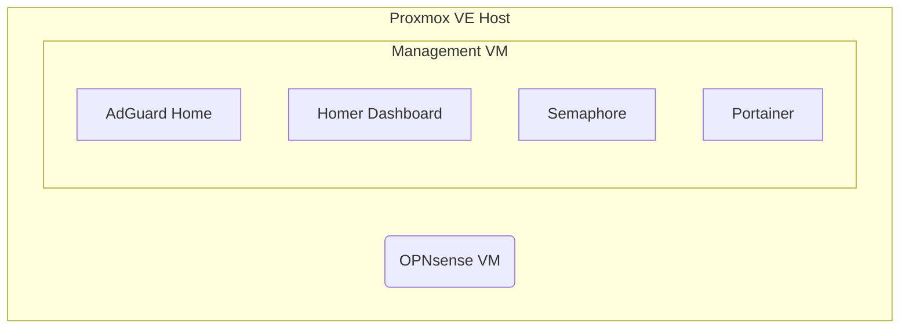

# PrivateBox

[](https://joinup.ec.europa.eu/collection/eupl/eupl-text-eupl-12)
[](CONTRIBUTING.md)

PrivateBox uses shell scripts, Python, and Ansible to turn a bare-metal Proxmox server into a production-ready, open-source firewall and network manager in about 15 minutes.

> **Note:** PrivateBox was originally designed as a commercial hardware appliance. Due to rising RAM and SSD prices making the target hardware unviable, the project has pivoted to a free and open-source software project. Bring your own hardware, run the scripts, and you're set.

---

### Architecture overview

PrivateBox runs two core virtual machines on a single Proxmox host. The Management VM, in turn, runs all the containerized services.


```mermaid
graph TD
    subgraph Proxmox VE Host
        A(OPNsense VM);
        subgraph Management VM
            direction TB
            D[AdGuard Home];
            E[Homer Dashboard];
            G[Semaphore];
            H[Portainer];
        end
    end
```

### Network layout

Two bridges, VLAN isolation, all services on a dedicated management network:

| Bridge | Role | Subnet |
| :--- | :--- | :--- |
| `vmbr0` | WAN (ISP uplink) | DHCP from ISP |
| `vmbr1` | LAN (VLAN-aware) | `10.10.10.0/24` (trusted), `10.10.20.0/24` (services), + guest/IoT/camera VLANs |

OPNsense routes between VLANs. All management services bind to `10.10.20.10` and are only accessible from the trusted network.

## Key features

-   **OPNsense® Firewall**: Deploys and configures a full OPNsense® VM for routing and security.
-   **Network-Wide DNS Filtering**: Deploys AdGuard Home for blocking ads and trackers on all devices.
-   **Fully Automated**: A single script orchestrates the entire deployment on a fresh Proxmox host.
-   **Web-Based Management**: Includes Portainer and Semaphore for easy management of your stack.
-   **Optional TLS Certificates**: Includes a playbook to automatically acquire Let's Encrypt certificates for a custom domain.

## System requirements

-   **Hardware**: A dual-NIC system with 8GB+ RAM and 20GB+ available storage.
-   **Software**: Proxmox VE 9.0 or higher.
-   **Network**: A stable internet connection for the initial installation.

## Quick start

Execute the following command on your Proxmox VE host. We recommend reviewing the script before running it.

```bash
curl -fsSL https://raw.githubusercontent.com/Rasped/privatebox/main/quickstart.sh -o quickstart.sh
bash quickstart.sh
```

---

## After installation

Credentials are displayed at the end of the bootstrap. All services use self-signed certificates (accept the browser warning).

| Service | Purpose | Access |
| :--- | :--- | :--- |
| **OPNsense®** | Firewall / Router (VM) | `https://10.10.20.1` |
| **AdGuard Home** | DNS Filtering & Ad-Blocking | `https://10.10.20.10:3443` |
| **Semaphore** | Ansible Automation UI | `https://10.10.20.10:2443` |
| **Portainer** | Container Management UI | `https://10.10.20.10:1443` |
| **Homer Dashboard** | Service Dashboard | `http://10.10.20.10:8081` |

These addresses are on the Services VLAN (`10.10.20.0/24`). Your devices need to be on the Trusted LAN (`10.10.10.0/24`) — OPNsense routes between them. This requires a VLAN-capable switch or WiFi access point. See the [network access rules](docs/guides/advanced/network-access-rules.md) and [VLAN guide](docs/guides/advanced/how-to-use-vlans.md) for details.

Once you point your network's DNS to `10.10.20.10`, the `.lan` domains also work (e.g. `https://adguard.lan`, `https://portainer.lan`).

<details>
<summary><b>View deployment process & advanced options</b></summary>

### Deployment architecture

The `quickstart.sh` script initiates a four-phase deployment:

1.  **Phase 1: Host Preparation**: Installs dependencies, configures Proxmox network bridges (`vmbr0` for WAN, `vmbr1` for LAN), and generates credentials and API tokens for automation.
2.  **Phase 2: VM Provisioning**: Downloads a Debian 13 cloud image and creates the core management VM using `cloud-init` to inject configuration, scripts, and credentials.
3.  **Phase 3: Guest Configuration**: Inside the VM, a script installs and configures the software stack, including Podman, Portainer, and a custom-built Semaphore image that includes Proxmox integration tools.
4.  **Phase 4: Service Orchestration**: The system uses its own Semaphore instance to bootstrap itself, creating the management project, inventories, and environments via its API. It then runs an orchestration script to deploy and configure OPNsense, AdGuard, and all other services in the correct dependency order.

### Installation arguments

The `quickstart.sh` script accepts several arguments for testing and development.

```bash
# Download the script to review it first (recommended)
curl -fsSL https://raw.githubusercontent.com/Rasped/privatebox/main/quickstart.sh -o quickstart.sh

# Then run with arguments:
bash quickstart.sh --dry-run      # Run pre-flight checks without creating a VM.
bash quickstart.sh --branch develop # Use a specific git branch for deployment.
bash quickstart.sh --verbose      # Enable detailed script output.
bash quickstart.sh --help         # Display all available arguments.
```

</details>

---

## Contributing

Contributions are welcome. Please review [CONTRIBUTING.md](CONTRIBUTING.md) for our code of conduct and pull request process.

## License

This project is licensed under the EUPL-1.2. See the [LICENSE](LICENSE) file for details.

---

## Known issues

### Intel i226-V power management bug

If your hardware uses Intel i226-V network controllers (common in Intel N100/N150/N200/N305 systems), **do not run `powertop --auto-tune`** or enable ASPM power management features. There is a confirmed bug in the Linux kernel `igc` driver that causes system freezes and network failures when power management is enabled on these controllers.

**Reference:** [Linux Kernel Bugzilla #218499](https://bugzilla.kernel.org/show_bug.cgi?id=218499)

**Workarounds:**
- Never use `powertop --auto-tune` on i226-V systems
- Disable ASPM in BIOS if experiencing network issues
- Add `pcie_aspm=off` to kernel boot parameters if needed

This issue does not affect normal PrivateBox operation.