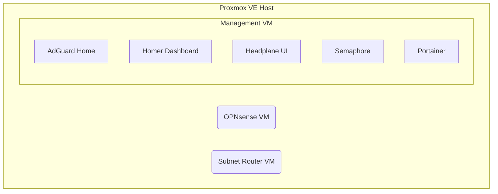

your data is not a product.

<div align="center">
  
</div>

# PrivateBox

[](https://joinup.ec.europa.eu/collection/eupl/eupl-text-eupl-12)
[](CONTRIBUTING.md)
[]()

PrivateBox is a project that uses shell scripts, Python, and Ansible to turn a bare-metal Proxmox server into a production-ready, open-source firewall and network manager in about 15 minutes.

---

## Why PrivateBox?

Manually setting up a secure network stack with a firewall, DNS filtering, and a VPN is a repetitive and time-consuming task. PrivateBox automates the entire process, providing a consistent, secure, and repeatable deployment with a single command. It is designed for developers and tech enthusiasts who value their time but refuse to compromise on control or transparency.

### Architecture overview

PrivateBox runs three core virtual machines on a single Proxmox host. The Management VM, in turn, runs all the containerized services.



### Network layout

Each component is deliberately placed in a specific network zone for security and performance:

| Component | Network Zone |
| :--- | :--- |
| Proxmox Host | Services VLAN |
| OPNsense VM | Services VLAN |
| Management VM | Services VLAN |
| **Subnet Router VM** | **Trusted LAN** |

## Key features

-   **OPNsense® Firewall**: Deploys and configures a full OPNsense® VM for routing and security.
-   **Network-Wide DNS Filtering**: Deploys AdGuard Home for blocking ads and trackers on all devices.
-   **Self-Hosted VPN**: Deploys Headscale to provide a secure WireGuard-based VPN for remote access.
-   **Fully Automated**: A single script orchestrates the entire deployment on a fresh Proxmox host.
-   **Web-Based Management**: Includes Portainer, Semaphore, and Headplane for easy management of your stack.
-   **Optional TLS Certificates**: Includes a playbook to automatically acquire Let's Encrypt certificates for a custom domain.

## System requirements

-   **Hardware**: A dual-NIC system with 8GB+ RAM and 20GB+ available storage.
-   **Software**: Proxmox VE 9.0 or higher.
-   **Network**: A stable internet connection for the initial installation.

## Quick start

Execute the following command on your Proxmox VE host. We recommend reviewing the script before running it.

```bash
curl -fsSL https://raw.githubusercontent.com/Rasped/privatebox/main/quickstart.sh -o quickstart.sh
bash quickstart.sh
```

## See it in action

Watch the 2-minute video to see the entire deployment process, from the `curl` command to the final dashboard.

[](https://www.youtube.com/watch?v=dQw4w9WgXcQ)
> *(Link to a 2-minute technical demo video is pending.)*

---

## What now? Your first login

After the script completes, your PrivateBox is running. 

-   The main dashboard is available at: **`https://privatebox.lan`**
-   Your credentials for the various services are displayed on screen at the end of the installation.

**IMPORTANT:** You must set up your Portainer admin account within 5 minutes of the first boot or after a restart. Navigate to **`https://portainer.lan`** to create your account.

### Homer dashboard screenshot
*(Placeholder for a screenshot of the final Homer dashboard. This is valuable for transparency, even if the UI is simple.)*

## Deployed services

The script deploys the following services, accessible from your trusted network:

| Service | Purpose | Access |
| :--- | :--- | :--- |
| **OPNsense®** | Firewall / Router (VM) | `https://opnsense.lan` |
| **AdGuard Home** | DNS Filtering & Ad-Blocking | `https://adguard.lan` |
| **Headplane** | Web UI for Headscale VPN | `https://headplane.lan/admin` |
| **Semaphore** | Ansible Automation UI | `https://semaphore.lan` |
| **Portainer** | Container Management UI | `https://portainer.lan` |
| **Homer Dashboard** | Service Dashboard | `https://privatebox.lan` |

<details>
<summary><b>View deployment process & advanced options</b></summary>

### Deployment architecture

The `quickstart.sh` script initiates a four-phase deployment:

1.  **Phase 1: Host Preparation**: Installs dependencies, configures Proxmox network bridges (`vmbr0` for WAN, `vmbr1` for LAN), and generates credentials and API tokens for automation.
2.  **Phase 2: VM Provisioning**: Downloads a Debian 13 cloud image and creates the core management VM using `cloud-init` to inject configuration, scripts, and credentials.
3.  **Phase 3: Guest Configuration**: Inside the VM, a script installs and configures the software stack, including Podman, Portainer, and a custom-built Semaphore image that includes Proxmox integration tools.
4.  **Phase 4: Service Orchestration**: The system uses its own Semaphore instance to bootstrap itself, creating the management project, inventories, and environments via its API. It then runs an orchestration script to deploy and configure OPNsense, AdGuard, and all other services in the correct dependency order.

### Installation arguments

The `quickstart.sh` script accepts several arguments for testing and development.

```bash
# Download the script to review it first (recommended)
curl -fsSL https://raw.githubusercontent.com/Rasped/privatebox/main/quickstart.sh -o quickstart.sh

# Then run with arguments:
bash quickstart.sh --dry-run      # Run pre-flight checks without creating a VM.
bash quickstart.sh --branch develop # Use a specific git branch for deployment.
bash quickstart.sh --verbose      # Enable detailed script output.
bash quickstart.sh --help         # Display all available arguments.
```

</details>

---

## Supporting the project

This project is and always will be free and open source. If you find it useful and would like to support its continued development, we also offer a pre-configured hardware appliance running the exact same software.

[**➡️ Learn More About the Hardware**](https://privatebox.com/preorder)

## Contributing

Contributions are welcome. Please review [CONTRIBUTING.md](CONTRIBUTING.md) for our code of conduct and pull request process.

## License

This project is licensed under the EUPL-1.2. See the [LICENSE](LICENSE) file for details.

---

## Known issues

### Intel i226-V power management bug

If your hardware uses Intel i226-V network controllers (common in Intel N100/N150/N200/N305 systems), **do not run `powertop --auto-tune`** or enable ASPM power management features. There is a confirmed bug in the Linux kernel `igc` driver that causes system freezes and network failures when power management is enabled on these controllers.

**Reference:** [Linux Kernel Bugzilla #218499](https://bugzilla.kernel.org/show_bug.cgi?id=218499)

**Workarounds:**
- Never use `powertop --auto-tune` on i226-V systems
- Disable ASPM in BIOS if experiencing network issues
- Add `pcie_aspm=off` to kernel boot parameters if needed

This issue does not affect normal PrivateBox operation.