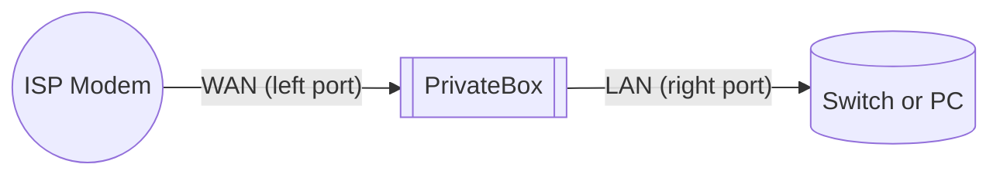

# Getting started guide

Welcome to PrivateBox! This guide will walk you through setting up your new network hardware.

If you are installing PrivateBox on your own Proxmox host, start with `quickstart.sh` in the repository root. This guide covers the network wiring and first access after the system is installed.

## 1. What's in the box

*   The PrivateBox unit
*   The power adapter
*   An ethernet cable

## 2. Physical setup

**The two network ports have specific roles. Connect them correctly or nothing will work:**

1.  **Connect WAN (Internet):** Plug your internet source (e.g., your modem from your ISP) into the **port on the left**.

2.  **Connect LAN (Your Network):** Use the included Ethernet cable to connect your main computer or a network switch to the **port on the right**.

3.  **Power On:** Plug the power adapter into your PrivateBox. The device will turn on automatically. The light on the front will illuminate.

4.  **Reboot your modem:** Many ISP modems need to be power-cycled to recognize PrivateBox as the new network gateway:
    - Unplug your modem's power
    - Wait 30 seconds
    - Plug it back in and wait 2-3 minutes for it to reconnect

## 3. Configure your existing router

**For PrivateBox to manage your network, you must disable the DHCP server on your existing WiFi router.** If you skip this step, you'll have no internet and devices won't connect properly.

The easiest way is to disable DHCP in your router settings.

Some routers have an "Access Point" or "AP Mode" setting. This automatically disables DHCP and is the preferred method if available.

1.  **Log in to your Wi-Fi router.** This usually involves visiting an IP address like `192.168.1.1` in your web browser and entering the admin password found on the router itself.
2.  **Find the DHCP Server setting.** It's commonly found in the "LAN", "Network", or "Advanced Settings" section.
3.  **Disable the DHCP Server.** Select the "Disable" or "Off" option and save your changes. Your router may need to restart.

**Note:** Every router is different. See our [Finding Router Settings](./finding-router-settings.md) guide or [Router Configuration Guide](./router-configuration.md) for specific router instructions.

## 4. First access

1.  **Connect to your network:** Make sure your computer is connected to your network (either via an Ethernet cable to the port on the right, or to your existing Wi-Fi).
2.  **Visit the dashboard:** Open a web browser and go to: **`https://privatebox.lan`**

    If `privatebox.lan` doesn't work, try `https://10.10.20.10` instead.

3.  **Accept the security warning:** You'll likely see a security warning page. **This is normal and expected.** It appears because your PrivateBox is using a private, self-signed security certificate instead of one from a public authority.
    *   Click **"Advanced"**
    *   Click **"Proceed to privatebox.lan"** or **"Accept the Risk and Continue"**

## 5. That's it

Your network is now protected by PrivateBox. All devices connected to your network will have their ads and trackers blocked automatically.

### Next steps

Now that you're up and running:

*   Read the **[Core Concepts](core-concepts.md)** guide to understand your network's new security features.
*   Want to segment your network for IoT devices or guests? Check out the **[How to Use VLANs](../advanced/how-to-use-vlans.md)** guide.

## 6. Quick setup checklist

- Cables connected: modem → left port (WAN), network/switch → right port (LAN)
- ISP modem rebooted after making the switch
- Old router DHCP disabled or AP mode enabled
- PrivateBox dashboard reachable at `https://privatebox.lan` or `https://10.10.20.10`
