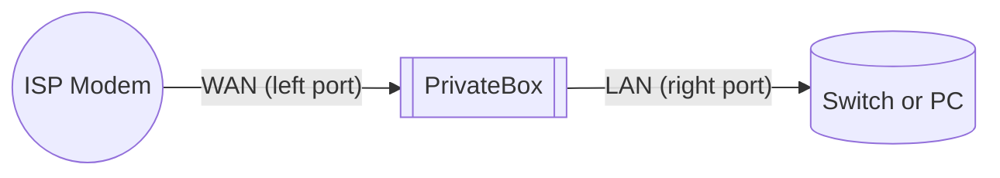

# Getting started guide

Welcome to PrivateBox! This guide walks you through setting up PrivateBox on your own hardware.

## 1. Prerequisites

- A dual-NIC system (two Ethernet ports) with 8GB+ RAM and 20GB+ storage
- Proxmox VE 9.0+ installed on the system
- A stable internet connection for the initial installation

## 2. Physical setup

**The two network ports have specific roles. Connect them correctly or nothing will work:**


```mermaid
flowchart LR
    Internet((ISP Modem)) -- WAN (left port) --> PrivateBox[[PrivateBox]]
    PrivateBox -- LAN (right port) --> Network[(Switch or PC)]
```

1.  **Connect WAN (Internet):** Plug your internet source (e.g., your modem from your ISP) into the **first network port** (typically the left one).

2.  **Connect LAN (Your Network):** Connect your computer or a network switch to the **second network port**.

3.  **Power On:** Boot the system. Proxmox VE should be running and accessible.

4.  **Reboot your modem:** Many ISP modems need to be power-cycled to recognize the new network gateway:
    - Unplug your modem's power
    - Wait 30 seconds
    - Plug it back in and wait 2-3 minutes for it to reconnect

## 3. Run the bootstrap

SSH into your Proxmox host and run:

```bash
curl -fsSL https://raw.githubusercontent.com/Rasped/privatebox/main/quickstart.sh -o quickstart.sh
bash quickstart.sh
```

This takes about 15 minutes. It will create VMs, deploy services, and configure everything automatically.

## 4. Configure your existing router

**For PrivateBox to manage your network, you must disable the DHCP server on your existing WiFi router.** If you skip this step, you'll have no internet and devices won't connect properly.

The easiest way is to disable DHCP in your router settings.

Some routers have an "Access Point" or "AP Mode" setting. This automatically disables DHCP and is the preferred method if available.

1.  **Log in to your Wi-Fi router.** This usually involves visiting an IP address like `192.168.1.1` in your web browser and entering the admin password found on the router itself.
2.  **Find the DHCP Server setting.** It's commonly found in the "LAN", "Network", or "Advanced Settings" section.
3.  **Disable the DHCP Server.** Select the "Disable" or "Off" option and save your changes. Your router may need to restart.

**Note:** Every router is different. See our [Finding Router Settings](./finding-router-settings.md) guide or [Router Configuration Guide](./router-configuration.md) for specific router instructions.

## 5. First access

1.  **Connect to your network:** Make sure your computer is connected to your network (either via Ethernet to the LAN port, or to your existing Wi-Fi).
2.  **Visit the dashboard:** Open a web browser and go to: **`https://privatebox.lan`**

    If `privatebox.lan` doesn't work, try `https://10.10.20.10` instead.

3.  **Accept the security warning:** You'll see a security warning page. **This is normal and expected.** It appears because PrivateBox uses a self-signed security certificate.
    *   Click **"Advanced"**
    *   Click **"Proceed to privatebox.lan"** or **"Accept the Risk and Continue"**

## 6. That's it

Your network is now protected by PrivateBox. All devices connected to your network will have their ads and trackers blocked automatically.

### Next steps

Now that you're up and running:

*   Read the **[Core Concepts](core-concepts.md)** guide to understand your network's security features.
*   Want to segment your network for IoT devices or guests? Check out the **[How to Use VLANs](../advanced/how-to-use-vlans.md)** guide.

## Quick setup checklist

- Proxmox VE installed on dual-NIC hardware
- Cables connected: modem to WAN port, network/switch to LAN port
- Bootstrap script run successfully
- ISP modem rebooted after making the switch
- Old router DHCP disabled or AP mode enabled
- PrivateBox dashboard reachable at `https://privatebox.lan` or `https://10.10.20.10`
