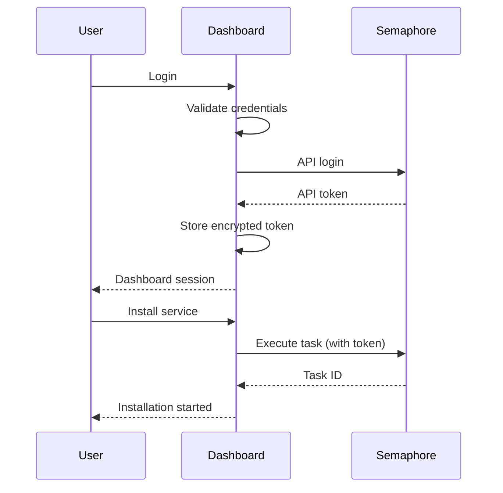

# Consumer Dashboard Architecture for PrivateBox

## ⚠️ FUTURE FEATURE - NOT CURRENTLY IMPLEMENTED ⚠️

This document describes a planned feature for PrivateBox that would enable mass consumer adoption by providing a user-friendly web interface. While the current system uses Semaphore for service management, this dashboard would provide a simpler, more accessible interface for non-technical users.

**Status**: Planned Future Feature  
**Priority**: High (for mass adoption)  
**Target Release**: TBD based on core platform stability  

---

## Executive Summary

PrivateBox needs a consumer-friendly interface that makes self-hosting as simple as using cloud services, while maintaining the power to orchestrate complex infrastructure including VMs (OPNsense, TrueNAS) and containers. After extensive consideration, we propose a dual-interface architecture:

1. **Consumer Dashboard**: A simple, service-oriented web interface for everyday users
2. **Semaphore**: The powerful Ansible execution engine for automation and power users

This approach balances simplicity with capability, avoiding the trap of oversimplifying infrastructure management while making it accessible to non-technical users.

## Core Design Principles

### 1. Consumer First, Power User Enabled
The primary interface must be simple enough for someone who has never used a terminal, while providing escape hatches for power users who want full control. We achieve this through layered interfaces rather than compromising either use case.

### 2. Service-Oriented, Not Task-Oriented  
Consumers think in terms of services ("I want ad blocking") not tasks ("Run ansible-playbook -i inventory adguard.yml"). The dashboard presents services while Semaphore handles tasks.

### 3. No Sacred Infrastructure
We build on existing tools (Semaphore, Ansible) but aren't afraid to enhance or replace them if they don't serve our users. Currently, Semaphore provides the best balance of features and maintainability.

### 4. Privacy and Security by Default
Every design decision must enhance user privacy and security. No telemetry, no external dependencies, encrypted by default.

## Architecture Overview

```
┌─────────────────────────────────────────────────────────────┐
│                         User Interfaces                      │
├─────────────────────┬───────────────────┬──────────────────┤
│  Consumer Dashboard │   Semaphore UI    │    SSH/CLI       │
│  (Simple & Visual)  │ (Task Management) │ (Full Control)   │
└──────────┬──────────┴─────────┬─────────┴──────────────────┘
           │                    │
           ▼                    ▼
┌─────────────────────────────────────────────────────────────┐
│                      Semaphore API                           │
│            (Authentication, Execution, Secrets)              │
└─────────────────────────┬────────────────────────────────────┘
                          │
                          ▼
┌─────────────────────────────────────────────────────────────┐
│                    Ansible Engine                            │
│         (Playbooks, Roles, Inventory Management)             │
└─────────────────────────┬────────────────────────────────────┘
                          │
                          ▼
┌─────────────────────────────────────────────────────────────┐
│                 Infrastructure Layer                         │
├─────────────────────┬────────────────────────────────────────┤
│    Proxmox VE       │         Management VM                  │
│  (VM Creation)      │    (Containers, Services)              │
└─────────────────────┴────────────────────────────────────────┘
```

## Why This Architecture?

### Why Keep Semaphore?

Initially, we considered removing Semaphore entirely, but it provides critical features that would be expensive to rebuild:

1. **Secure Secrets Management**: Built-in encryption for passwords, API keys, certificates
2. **Audit Trail**: Complete history of who ran what and when
3. **Task Scheduling**: Cron-like scheduling for updates and maintenance
4. **Multi-User Support**: RBAC with projects and permissions
5. **API-First Design**: Everything accessible via REST API
6. **Active Development**: Regular updates and security patches

### Why Not Just Semaphore?

Semaphore alone is insufficient because:

1. **Task-Oriented UI**: Shows Ansible tasks, not user services
2. **No Service State**: Doesn't track what's installed or running
3. **Technical Interface**: Requires understanding of Ansible concepts
4. **No Service Discovery**: Can't browse available services easily

### Why Not Existing Solutions?

We evaluated several alternatives:

- **Runtipi/CasaOS/Umbrel**: Container-only, can't handle VM orchestration
- **Yacht**: Docker-focused, limited orchestration capabilities  
- **Portainer**: Container management, not service orchestration
- **Custom Ansible UI**: Would recreate Semaphore's functionality

## Technology Stack

### Backend: Go (Golang)

**Rationale**:
- Single binary deployment (critical for appliance-like experience)
- Excellent concurrency for status monitoring
- Same language as Semaphore (easier integration)
- Strong standard library for web services
- Fast compilation enabling quick iteration

**Alternatives Considered**:
- **Python**: Easier development but complex deployment
- **Node.js**: Good ecosystem but runtime dependencies
- **Rust**: Excellent performance but steeper learning curve

### Frontend: Vue.js 3 + Tailwind CSS

**Rationale**:
- **Vue.js**: Gentler learning curve than React, better documentation
- **Composition API**: Modern, maintainable code structure
- **Tailwind**: Rapid UI development with consistent design
- **Mobile-First**: Critical for consumer accessibility

**Alternatives Considered**:
- **React**: More complex, larger ecosystem we don't need
- **HTMX**: Considered for simplicity but limits interactivity
- **Angular**: Too heavy for our needs
- **Vanilla JS**: Would slow development significantly

### Data Storage: SQLite

**Rationale**:
- Zero configuration database
- Single file backup/restore
- Sufficient for metadata storage
- No separate database service

**What We Store**:
- Service catalog metadata
- Installation status
- User preferences
- Dashboard configuration

**What We Don't Store**:
- Secrets (handled by Semaphore)
- Ansible playbooks (in Git)
- Infrastructure state (queried live)

## Service Catalog Design

### Directory Structure

```
services/
├── categories.yml           # Category definitions
├── networking/
│   └── opnsense/
│       ├── metadata.yml    # Service definition
│       ├── icon.svg        # Vector icon
│       ├── README.md       # User documentation
│       ├── playbooks/
│       │   ├── install.yml
│       │   ├── configure.yml
│       │   ├── start.yml
│       │   ├── stop.yml
│       │   ├── status.yml
│       │   ├── update.yml
│       │   └── uninstall.yml
│       ├── templates/      # Semaphore template definitions
│       └── tests/          # Service test playbooks
├── storage/
│   ├── truenas/
│   └── nextcloud/
├── privacy/
│   ├── adguard/
│   ├── pihole/
│   └── wireguard/
└── media/
    ├── jellyfin/
    └── plex/
```

### Service Metadata Schema

```yaml
# metadata.yml
service:
  id: "opnsense"                    # Unique identifier
  name: "OPNsense"                  # Display name
  tagline: "Enterprise firewall"     # Short description
  description: |                     # Full description
    OPNsense is an open source, easy-to-use firewall
    and routing platform based on FreeBSD.
  version: "24.7"                   # Service version
  maintainer: "PrivateBox Team"     # Who maintains this
  
categories:
  - networking
  - security

deployment:
  type: "vm"                        # vm or container
  method: "proxmox"                 # proxmox or podman
  
requirements:
  cpu: 2
  ram: "2048MB"
  storage: "20GB"
  network:
    - type: "wan"
      description: "Internet connection"
    - type: "lan"
      description: "Local network"
  
# For complex VM networking
network_topology:
  interfaces:
    - id: "wan"
      type: "bridge"
      bridge: "vmbr0"
      vlan_aware: true
      description: "External network connection"
      
    - id: "lan"
      type: "bridge"
      bridge: "vmbr1"
      subnet: "192.168.1.0/24"
      dhcp: true
      description: "Internal trusted network"
      
    - id: "dmz"
      type: "bridge"
      bridge: "vmbr2"
      subnet: "192.168.2.0/24"
      vlan: 100
      description: "DMZ for exposed services"
      
  routing:
    - from: "lan"
      to: "wan"
      via: "opnsense"
      nat: true
      
    - from: "dmz"
      to: "wan"
      via: "opnsense"
      nat: true
      firewall_zone: "dmz"

features:
  - "Stateful packet inspection firewall"
  - "Traffic shaping and QoS"
  - "Two-factor authentication"
  - "OpenVPN and WireGuard support"
  
interfaces:
  - name: "Web Interface"
    protocol: "https"
    port: 443
    path: "/"
    description: "Main administration interface"
    
  - name: "SSH Console"
    protocol: "ssh"
    port: 22
    description: "Command line access"

configuration:
  # Variables exposed in dashboard install wizard
  - name: "wan_interface"
    label: "WAN Interface"
    type: "select"
    options: "{{ network_interfaces }}"
    required: true
    
  - name: "lan_subnet"
    label: "LAN Subnet"
    type: "text"
    default: "192.168.1.0/24"
    validation: "cidr"
    required: true
    
  - name: "admin_password"
    label: "Admin Password"
    type: "password"
    generate: true
    required: true

post_install:
  notes: |
    OPNsense is now installing. Initial setup may take 10-15 minutes.
    Once complete, access the web interface to complete configuration.
  credentials:
    username: "root"
    password: "{{ admin_password }}"
```

### Service Lifecycle Playbooks

Each service implements standard lifecycle operations:

1. **install.yml**: Creates infrastructure (VM/container)
2. **configure.yml**: Post-install configuration
3. **start.yml**: Starts the service
4. **stop.yml**: Gracefully stops the service  
5. **status.yml**: Returns service state as JSON
6. **update.yml**: Updates to latest version
7. **uninstall.yml**: Removes service completely

## Multi-User & Family Scenarios

### User Model Considerations

PrivateBox must handle household scenarios where multiple family members share infrastructure but need isolation:

```yaml
# User permission model
user_roles:
  admin:
    - description: "Full system control (parents)"
    - can: ["install_services", "modify_network", "manage_users", "view_all_logs"]
    
  user:
    - description: "Service user (family members)"
    - can: ["use_services", "view_own_services", "start_stop_own"]
    
  restricted:
    - description: "Limited access (children)"
    - can: ["use_whitelisted_services"]
    - cannot: ["install_services", "modify_settings"]
```

### Service Isolation

1. **Network Isolation**: Services can be VLAN-separated by user
2. **Resource Quotas**: Per-user CPU/RAM/storage limits
3. **Access Control**: Service-level user permissions
4. **Audit Trail**: Who did what and when

### Conflict Prevention

```go
// Prevent conflicting operations
type OperationLock struct {
    ServiceID   string
    UserID      string
    Operation   string
    AcquiredAt  time.Time
    ExpiresAt   time.Time
}

// Before any service operation
func AcquireServiceLock(serviceID, userID, operation string) error {
    // Prevent User A from stopping service while User B is configuring it
}
```

## Platform Compatibility & Requirements

### Proxmox Version Support

```yaml
# Supported Proxmox versions
proxmox_compatibility:
  minimum_version: "7.0"
  tested_versions:
    - "7.0-7.4": "full_support"
    - "8.0-8.2": "full_support"
    - "8.3+": "experimental"
  
  required_features:
    - qemu_version: ">=6.0"
    - storage_types: ["local", "local-lvm", "zfs", "nfs"]
    - network_types: ["vmbr", "ovs"]
```

### Hardware Requirements

```yaml
# Minimum and recommended specifications
hardware_requirements:
  minimum:
    cpu: "4 cores @ 2.0GHz"
    ram: "8GB"
    storage: "120GB SSD"
    network: "1Gbps NIC"
    notes: "Suitable for 3-5 lightweight services"
    
  recommended:
    cpu: "8 cores @ 2.5GHz+"
    ram: "32GB"
    storage: "500GB NVMe SSD"
    network: "2x 1Gbps NICs"
    notes: "Supports 15-20 services including VMs"
    
  enterprise:
    cpu: "16+ cores"
    ram: "64GB+"
    storage: "1TB+ NVMe with redundancy"
    network: "10Gbps or multiple 1Gbps"
    notes: "Full platform with all services"
```

### Storage Backend Considerations

1. **ZFS**: Preferred for snapshots and data integrity
2. **LVM-Thin**: Good performance, efficient provisioning
3. **NFS**: Supported but performance considerations
4. **Ceph**: Not recommended for single-node setups

## API Design

### Dashboard → Semaphore Integration

The dashboard acts as a translation layer between user intent and Ansible operations:

```
User Action         Dashboard API       Semaphore API         Ansible
-----------         -------------       -------------         -------
Click Install  -->  POST /services  --> POST /tasks      --> install.yml
                    /opnsense/install    (template_id: 5)     
```

### Key API Endpoints

```go
// Dashboard API (Consumer-facing)
GET    /api/services              // List available services
GET    /api/services/:id          // Get service details
POST   /api/services/:id/install  // Install a service
DELETE /api/services/:id          // Uninstall a service
POST   /api/services/:id/start    // Start a service
POST   /api/services/:id/stop     // Stop a service
GET    /api/services/:id/status   // Get current status

// Dashboard → Semaphore mapping
GET    /api/semaphore/projects    // List Semaphore projects
POST   /api/semaphore/tasks       // Execute Ansible playbook
GET    /api/semaphore/tasks/:id   // Get task status
```

### Authentication Flow



## User Experience Design

### First-Time User Flow

1. **Welcome Screen**
   - Brief explanation of PrivateBox
   - Privacy promise (your data stays yours)
   - Quick setup wizard

2. **Service Discovery**
   - Grid view of available services
   - Categories for easy browsing
   - Search functionality
   - Each shows requirements clearly

3. **Installation Wizard**
   - Click service → Configuration form
   - Smart defaults for everything
   - Advanced options collapsed
   - Clear resource requirements
   - One-click install

4. **Post-Install**
   - Progress indicator during install
   - Clear success/failure message
   - Access button for service
   - Next steps guidance

### Returning User Flow

1. **Dashboard Home**
   - Installed services at top
   - Status indicators (green/yellow/red)
   - Quick actions per service
   - Resource usage summary

2. **Service Management**
   - Start/stop with confirmation
   - View logs if needed
   - Update notifications
   - Access URLs prominent

## Implementation Phases

### Phase 1: Foundation (Weeks 1-4)
- [ ] Basic Go web server
- [ ] Semaphore API client
- [ ] Service catalog structure
- [ ] Simple HTML UI
- [ ] Install/uninstall for one service

### Phase 2: Core Features (Weeks 5-8)
- [ ] Vue.js frontend
- [ ] Service status monitoring
- [ ] Multiple service support
- [ ] Basic authentication
- [ ] Error handling

### Phase 3: Polish (Weeks 9-12)
- [ ] Mobile responsive design
- [ ] Advanced configurations
- [ ] Service dependencies
- [ ] Update management
- [ ] Comprehensive testing

### Phase 4: Enhancement (Ongoing)
- [ ] Service marketplace
- [ ] Community templates
- [ ] Backup/restore
- [ ] Monitoring dashboards
- [ ] Plugin system

## Security Considerations

### Authentication & Authorization
- Local user accounts (no external dependencies)
- Optional LDAP/OIDC integration
- Session management with secure cookies
- API token rotation

### Secrets Management
- All secrets stored in Semaphore
- Dashboard never stores passwords
- Generated passwords use secure random
- Encryption at rest for sensitive data

### Network Security
- HTTPS only for dashboard
- Automatic Let's Encrypt certificates
- CORS properly configured
- Rate limiting on API endpoints

### Audit & Compliance
- All actions logged
- Audit trail preserved
- No telemetry or analytics
- GDPR-compliant by design

## State Management & Synchronization

### The State Drift Problem

One of the most critical challenges is managing state for complex VM services like OPNsense and TrueNAS. Unlike containers which are largely stateless, these services:

1. **Have Complex Internal State**: Firewall rules, VLANs, storage pools
2. **Can Be Modified Outside Dashboard**: Users might change settings directly
3. **Are Critical Infrastructure**: State drift could break connectivity

### State Management Strategy

```yaml
# Enhanced metadata.yml for stateful services
service:
  id: "opnsense"
  stateful: true
  state_management:
    sync_method: "api"  # api, ssh, or ansible
    sync_endpoints:
      - type: "config_backup"
        endpoint: "/api/core/backup/download"
      - type: "interface_status"
        endpoint: "/api/interfaces/overview"
    sync_interval: 300  # seconds
    
  # Critical state that must be preserved
  critical_state:
    - firewall_rules
    - interface_assignments
    - vpn_configurations
    - user_accounts
```

### Synchronization Approach

1. **Read-Only Sync**: Dashboard never modifies state directly, only through Ansible
2. **Configuration Backup**: Regular automated backups before any changes
3. **Drift Detection**: Compare expected vs actual state, warn on differences
4. **Manual Sync**: "Sync Now" button for immediate state refresh

## Resource Management & Constraints

### Resource Allocation System

```go
// Resource tracking in dashboard
type SystemResources struct {
    TotalCPU     int
    TotalRAM     int64
    TotalStorage int64
    
    AllocatedCPU     int
    AllocatedRAM     int64
    AllocatedStorage int64
    
    ReservedCPU     int   // For system overhead
    ReservedRAM     int64 // Minimum free RAM
}

// Before allowing installation
func CanInstallService(service Service, resources SystemResources) (bool, error) {
    if resources.AvailableCPU() < service.Requirements.CPU {
        return false, fmt.Errorf("Insufficient CPU: need %d cores, have %d available", 
            service.Requirements.CPU, resources.AvailableCPU())
    }
    // Similar checks for RAM and storage
}
```

### Resource Policies

1. **Hard Limits**: Never exceed 80% of total resources
2. **Soft Warnings**: Warn at 60% utilization
3. **Reserved Resources**: Keep 20% for system operations
4. **Service Priorities**: Critical services (OPNsense) get resource priority

## Error Handling & Translation

### Ansible Error Translation System

```yaml
# error-mappings.yml
error_mappings:
  - pattern: "fatal.*FAILED.*undefined variable"
    user_message: "Configuration error: A required setting is missing"
    recovery: "Check service configuration and try again"
    
  - pattern: "fatal.*UNREACHABLE.*ssh.*Connection refused"
    user_message: "Cannot connect to the server"
    recovery: "Ensure the management VM is running and accessible"
    
  - pattern: "fatal.*Timeout.*waiting for connection"
    user_message: "Service is taking too long to start"
    recovery: "This might be normal for first-time setup. Wait a few minutes and refresh"
    
  - pattern: "fatal.*No space left on device"
    user_message: "Storage full - cannot complete installation"
    recovery: "Free up disk space or add more storage"
```

### Error Context Enhancement

```go
// Enhance Ansible errors with context
type EnhancedError struct {
    OriginalError   string
    UserMessage     string
    ServiceContext  string
    RecoverySteps   []string
    DocumentationLink string
    SupportCommand  string  // e.g., "privatebox diagnose opnsense"
}
```

## Challenges and Mitigations

### Challenge 1: Service Status Accuracy
**Problem**: Ansible playbooks run periodically, status might be stale  
**Mitigation**: 
- Implement WebSocket for real-time updates
- Cache status with TTL
- Show last updated timestamp
- Refresh button for manual update

### Challenge 2: Complex Service Dependencies
**Problem**: Some services require others (e.g., TrueNAS needs network)  
**Mitigation**:
- Dependency graph in metadata
- Automatic ordering of operations
- Clear dependency warnings
- Suggest installation order

### Challenge 3: Error Recovery
**Problem**: Installations can fail midway  
**Mitigation**:
- Idempotent playbooks
- Rollback procedures
- Clear error messages
- Manual recovery guides

### Challenge 4: Mobile Experience
**Problem**: Complex operations on small screens  
**Mitigation**:
- Mobile-first design
- Progressive disclosure
- Touch-friendly controls
- Simplified mobile views

### Challenge 5: Network Configuration Complexity
**Problem**: VM services need complex networking (VLANs, bridges, multiple NICs)  
**Mitigation**:
- Network topology visualization
- Guided network setup wizard
- Pre-validated network templates
- Automatic VLAN assignment

**Network Wizard Example**:
```yaml
# Network templates for common scenarios
network_templates:
  simple_home:
    name: "Simple Home Network"
    description: "One WAN, one LAN, basic firewall"
    suitable_for: ["apartments", "small homes"]
    
  advanced_home:
    name: "Advanced Home Network"
    description: "WAN + LAN + Guest + IoT VLANs"
    suitable_for: ["tech enthusiasts", "smart homes"]
    
  small_business:
    name: "Small Business"
    description: "WAN + LAN + DMZ + Guest networks"
    suitable_for: ["home offices", "small businesses"]
```

### Challenge 6: Disaster Recovery
**Problem**: Management VM failure would cripple the system  
**Mitigation**:
- Automated backup of dashboard database
- Service configuration exports
- Recovery playbook on Proxmox host
- Emergency SSH access documentation

## Future Considerations

### Potential Enhancements
1. **Service Marketplace**: Community-contributed services
2. **Templating System**: Create custom service combinations
3. **Monitoring Integration**: Prometheus/Grafana dashboards
4. **Backup Automation**: Scheduled encrypted backups
5. **Multi-Node Support**: Manage multiple PrivateBox instances

### Potential Pivots
1. **Replace Semaphore**: If limitations found, build minimal alternative
2. **Electron App**: Desktop application for local management
3. **Mobile Apps**: Native iOS/Android apps
4. **SaaS Offering**: Hosted management plane (privacy-preserving)

## Disaster Recovery & Business Continuity

### Failure Scenarios

1. **Management VM Failure**
   - **Impact**: Cannot manage services through dashboard
   - **Recovery**: Bootstrap new management VM from backup
   - **Time to Recovery**: 15-30 minutes

2. **Semaphore Database Corruption**
   - **Impact**: Loss of task history, credentials
   - **Recovery**: Restore from nightly backup
   - **Prevention**: Regular database integrity checks

3. **Dashboard Failure**
   - **Impact**: No consumer interface
   - **Fallback**: Direct Semaphore access, SSH
   - **Recovery**: Restart dashboard service

### Backup Strategy

```yaml
# backup-policy.yml
backup:
  schedules:
    - name: "dashboard-config"
      frequency: "daily"
      retention: 7
      includes:
        - /opt/privatebox/dashboard/data
        - /opt/privatebox/dashboard/config
        
    - name: "semaphore-data"
      frequency: "daily"
      retention: 7
      includes:
        - /opt/semaphore/database
        - /opt/semaphore/config
        
    - name: "service-configs"
      frequency: "after-change"
      retention: 30
      includes:
        - "{{ service_config_paths }}"
```

### Emergency Access

1. **Break-Glass Procedure**: Root SSH access to Proxmox
2. **Service Direct Access**: All services accessible without dashboard
3. **Recovery Documentation**: Printed/offline copy of procedures

## Testing Strategy

### Test Infrastructure

```yaml
# test-environments.yml
environments:
  - name: "unit-tests"
    type: "docker-compose"
    resources:
      cpu: 2
      ram: "4GB"
    components:
      - mock-proxmox-api
      - mock-semaphore
      - test-dashboard
      
  - name: "integration-tests"
    type: "nested-vm"
    resources:
      cpu: 4
      ram: "8GB"
    components:
      - proxmox-ve-nested
      - full-stack
      
  - name: "service-tests"
    type: "isolated-vlan"
    resources:
      cpu: 8
      ram: "16GB"
    components:
      - test-proxmox-cluster
      - service-deployment-tests
```

### Test Categories

1. **Smoke Tests**: Basic functionality (5 minutes)
2. **Service Deployment**: Test each service in isolation
3. **Integration Tests**: Multi-service scenarios
4. **Failure Tests**: Disaster recovery procedures
5. **Performance Tests**: Load and scale testing

## Monitoring & Alerting

### Consumer-Friendly Monitoring

Unlike enterprise monitoring, PrivateBox monitoring must be:
1. **Automatic**: No configuration required
2. **Understandable**: Plain language, not technical metrics
3. **Actionable**: Clear steps to resolve issues
4. **Non-intrusive**: Only alert when necessary

### Health Check System

```yaml
# Service health definitions
health_checks:
  - id: "disk_space"
    severity: "warning"
    threshold: "80%"
    message: "Storage space running low"
    action: "Delete old backups or add more storage"
    
  - id: "memory_pressure"
    severity: "warning"
    threshold: "85%"
    message: "System memory is almost full"
    action: "Restart unused services or upgrade RAM"
    
  - id: "service_down"
    severity: "critical"
    message: "{service} has stopped working"
    action: "Click here to restart {service}"
    
  - id: "backup_failed"
    severity: "warning"
    message: "Backup didn't complete last night"
    action: "Check backup settings"
```

### Alert Delivery

1. **Dashboard Banner**: Non-critical alerts
2. **Email**: Critical alerts (optional)
3. **Mobile Push**: Future enhancement
4. **LED Indicator**: Hardware integration possibility

### Metrics Storage

```go
// Lightweight metrics for consumer dashboard
type ServiceMetrics struct {
    ServiceID     string
    Timestamp     time.Time
    Status        string  // "healthy", "degraded", "down"
    ResponseTime  int     // milliseconds
    ResourceUsage struct {
        CPU    float32  // percentage
        Memory int64    // bytes
        Disk   int64    // bytes
    }
}

// Keep only recent data to avoid bloat
const MaxMetricsAge = 7 * 24 * time.Hour
```

## Critical Early Tests

### Week 1-2: Proof of Concept Validation

1. **Proxmox API Integration**
   - Can we create/destroy VMs programmatically?
   - Network configuration automation working?
   - Resource allocation tracking accurate?

2. **Semaphore API Stability**
   - Token management reliable?
   - Can we handle long-running tasks?
   - Error reporting sufficient?

3. **State Management**
   - Can we detect OPNsense configuration changes?
   - VM status polling performant?
   - State synchronization reliable?

### Week 3-4: User Experience Validation

1. **Error Handling**
   - Are translated errors understandable?
   - Recovery procedures clear?
   - Failure modes graceful?

2. **Performance at Scale**
   - Dashboard responsive with 20+ services?
   - Status updates timely?
   - Resource usage acceptable?

3. **Mobile Experience**
   - Core functions work on mobile?
   - Touch targets adequate?
   - Performance acceptable?

### Critical Decision Points

1. **Week 2**: Proxmox integration complexity acceptable?
2. **Week 4**: State management strategy working?
3. **Week 6**: User testing feedback positive?
4. **Week 8**: Performance meets requirements?

## Success Metrics

### User Experience
- Time to first service: <5 minutes
- Clicks to install service: ≤3
- Dashboard load time: <2 seconds
- Mobile usability score: >95%

### Technical
- API response time: <200ms (p95)
- Status update latency: <5 seconds
- Concurrent users: >100
- Service catalog size: >50 services

### Adoption
- User retention: >80% after 30 days
- Services per user: >3 average
- Community contributions: >10/month
- Support tickets: <5% of users

## Conclusion

This architecture balances the competing needs of simplicity and power by providing multiple interfaces to the same underlying automation. The consumer dashboard makes self-hosting accessible to everyone, while Semaphore and SSH access ensure power users are never constrained.

By building on proven tools (Semaphore, Ansible) rather than reinventing them, we can focus on the user experience layer that makes the difference between a technical tool and a consumer product. The modular design allows us to evolve based on user feedback without major architectural changes.

### Critical Success Factors

1. **State Management**: Must solve the state drift problem early
2. **Resource Constraints**: Prevent over-provisioning from day one
3. **Error Translation**: Make failures understandable to consumers
4. **Disaster Recovery**: Test recovery procedures thoroughly
5. **Multi-User Support**: Handle family scenarios gracefully

### Next Steps

1. **Validate Core Assumptions**: Test Proxmox/Semaphore integration
2. **Build Minimal Prototype**: Single service end-to-end
3. **User Testing**: Get feedback on error messages and flows
4. **Performance Testing**: Ensure scalability to 20+ services
5. **Documentation**: Create user and developer guides

This is a living document that will evolve as we build, test, and learn from users. The architecture is deliberately flexible to accommodate the lessons we'll learn during implementation.